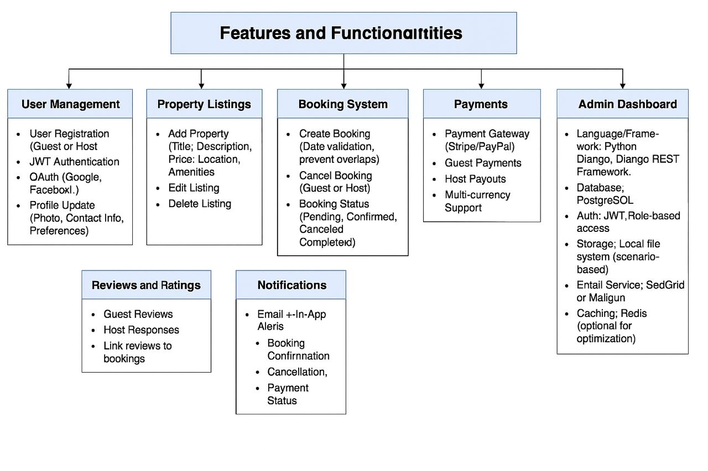

# alx-airbnb-project-documentation
This repository documents the backend architecture and functionalities for an Airbnb clone project.

## ✅ Features and Functionalities Diagram

The diagram illustrates the major modules supported by the backend system. These include:

- *User Management*
  - Registration (Guests and Hosts)
  - JWT Authentication & OAuth
  - Profile updates

- *Property Listings*
  - Add/Edit/Delete Listings
  - Property attributes like title, location, price, and amenities

- *Search & Filtering*
  - By location, price range, amenities, number of guests

- *Booking System*
  - Booking creation, cancellation, and status tracking
  - Date validation to prevent double bookings

- *Payment Integration*
  - Secure payment via Stripe or PayPal
  - Host payouts
  - Multi-currency support

- *Reviews and Ratings*
  - Guests can leave feedback linked to bookings
  - Hosts can respond to reviews

- *Notifications*
  - In-app and email alerts for booking updates and payments

- *Admin Dashboard*
  - Monitor and manage users, bookings, properties, and transactions

---

## 🛠️ Technical Stack Overview

- *Backend Framework*: Python, Django, Django REST Framework  
- *Database*: PostgreSQL  
- *Authentication*: JWT, OAuth (Google, Facebook)  
- *Storage*: File system (for images and uploads)  
- *Email Service*: SendGrid or Mailgun  
- *Caching*: Redis (for optimization)  

---

## 📎 Diagram File

You can find the detailed PNG diagram under:
