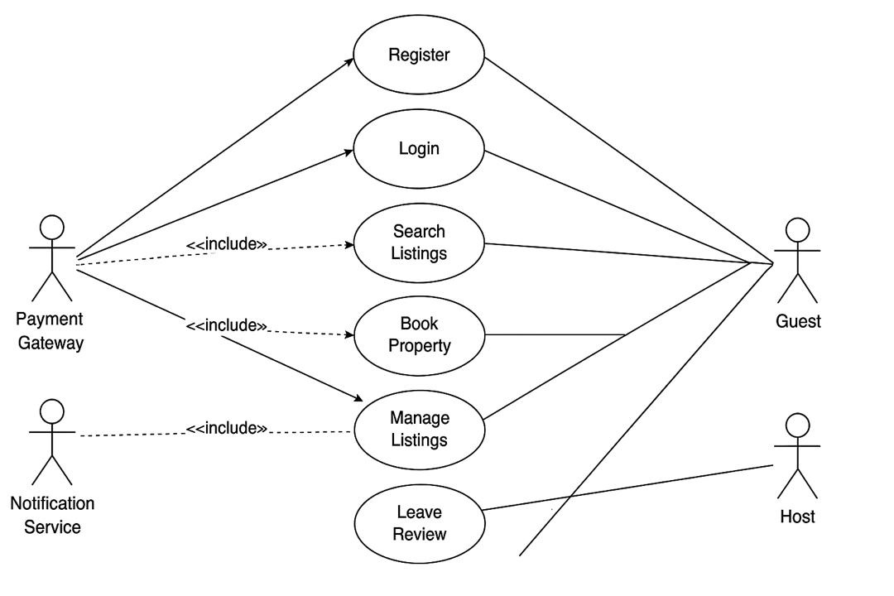

# alx-airbnb-project-documentation

## 📂 Use Case Diagram

This diagram visualizes the system's functionalities from the user's perspective. It outlines the interactions between key actors and the core features of the Airbnb clone backend.

### Key Actors

* **Guest**: An authenticated user who books properties, leaves reviews, and makes payments.
* **Host**: An authenticated user who lists properties and manages bookings.
* **Payment Gateway**: An external system responsible for processing payments.
* **Notification Service**: An external system for sending email and in-app alerts.

### Key Use Cases

The diagram captures the following major functionalities:

* **User Management**: `Register` and `Login` for both Guests and Hosts.
* **Property Interaction**: `Search Listings` and `Book Property` for Guests.
* **Host Management**: `Manage Listings` (including adding, editing, and deleting properties) for Hosts.
* **Reviews**: `Leave Review` for Guests, linked to completed bookings.

### Relationships

* **Association**: The solid lines connecting actors to use cases indicate the actor's ability to perform that action.
* **`<<include>>`**: This relationship is used to show where an external service is required for a use case to be completed. For example, `Book Property` includes interactions with the `Payment Gateway`.

---

## 📎 Diagram File

The use case diagram can be found in the directory `use-case-diagram/` as a JPEG file.

